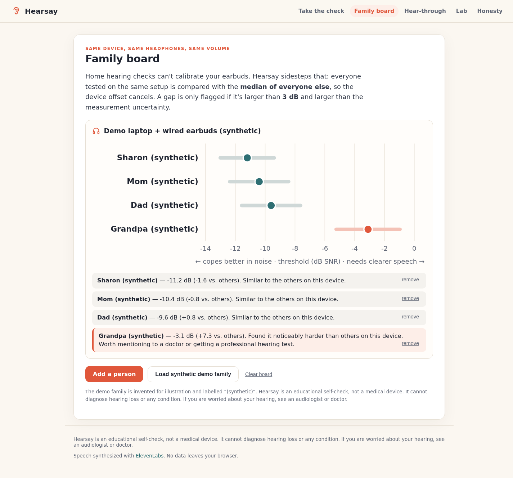

# Hearsay — a 3-minute hearing-in-noise check for families

> "What?" is the most expensive word at dinner.

Hearsay is a browser-based **educational listening task** exploring speech in noise. You hear three spoken digits in noise, type them, and a **Bayesian adaptive engine** picks the next noise level based on its model of your answers. In the simulated-listener evaluation, it stopped after about 12 triplets on average.

Home headphones are not calibrated, so Hearsay **does not show a clinical ‘normal range’**. Its family board compares task results **on the same device, headphones and volume**. A shared device offset cancels mathematically under the comparison model; fit, attention, language and environment can still differ. The comparisons and flagging threshold have not been clinically validated.

**Hearsay is not a medical device and does not diagnose anything.** It has not been clinically validated.

- Live demo: https://sharonbasovich.github.io/hearsay/ (or run locally, below)
- Demo video (2:20): watch at https://sharonbasovich.github.io/hearsay/video/ (source file: [`docs/hearsay-demo.mp4`](docs/hearsay-demo.mp4))
- Devpost write-up: [`docs/DEVPOST.md`](docs/DEVPOST.md)
- One-page summary: [`docs/hearsay-one-pager.pdf`](docs/hearsay-one-pager.pdf)
- Source code PDF: [`docs/hearsay-source-code.pdf`](docs/hearsay-source-code.pdf)
- Regenerate both PDFs: `npm run export:pdfs` (needs Chrome; set `CHROME=/path/to/chrome` if `google-chrome` is not on PATH)
- Data provenance and limitations: [`docs/PROVENANCE.md`](docs/PROVENANCE.md)



## Features

| Screen | What it does |
| --- | --- |
| **Take the check** | Volume setup → 6-trial headphone check (antiphase-tone method) → adaptive digits-in-noise test with a live belief chart → result with 90% credible interval |
| **Family board** | Groups results by device; compares each person with the median of the others; flags only gaps > 3 dB *and* larger than the measurement uncertainty |
| **Hear-through** | Plays a sentence and digits through illustrative high-frequency attenuation profiles so relatives can hear why "just listen harder" doesn't work |
| **Lab** | Runs a seeded simulation study in your browser: Hearsay vs. classic staircases on hundreds of virtual listeners |
| **Honesty** | What's real, what's synthetic, and what's missing |

A "Watch a virtual listener" button in the Lab runs the real test UI with a simulated listener answering, so judges can see the full flow without headphones.

## Measured results (simulation, `npm run simulate`)

400 virtual listeners, true SRT uniform in [-14, 2] dB, 2% lapse rate, each tested twice:

| Procedure | Avg. triplets | RMSE (dB) | Test–retest SD (dB) | 90% interval coverage |
| --- | --- | --- | --- | --- |
| Staircase, 24 trials (classic) | 24.0 | 0.79 | 1.05 | 62% |
| Staircase, 12 trials | 12.0 | 1.53 | 1.31 | 54% |
| **Hearsay Bayesian** | **11.8** | **1.01** | 1.42 | **94%** |

True psychometric slope 0.7/dB. Results at slopes 0.5 and 1.0 are in [`docs/validation.json`](docs/validation.json).

Plainly: at the same length Hearsay has ~34% lower error than a staircase and honest error bars; the classic 24-trial staircase is still a bit more precise, at twice the length. These are **simulated listeners, not people**.

## How it works

- **Stimuli** — nine digit words (0–9 without the two-syllable "7") synthesized once with ElevenLabs TTS, trimmed and RMS-equalized; stationary speech-shaped noise computed locally from their long-term spectrum (`scripts/make-stimuli.ts`, `src/dsp/`).
- **Presentation** — digits are phase-inverted in one ear while the noise is identical in both (antiphasic), as in published antiphasic digits-in-noise designs (`src/audio/mix.ts`).
- **Engine** — grid posterior over threshold × slope (3 slopes marginalized), logistic psychometric function with lapses, next SNR chosen to minimize expected posterior entropy of the threshold, stop at posterior SD ≤ 1.25 dB (min 10, max 24 trials) (`src/engine/bayes.ts`).
- **Family comparison** — leave-one-out median; verdict requires `delta > max(3 dB, 1.645·hypot(sd_i, sd_ref))`; mathematically invariant to a shared device offset (`src/engine/family.ts`, tested).
- **Privacy** — no backend; results live in `localStorage` only.

## Run it

```bash
npm install
npm run dev        # http://localhost:5173
npm test           # 32 unit tests (engine, DSP, mixing, family logic, shipped stimuli)
npm run typecheck
npm run build      # static site in dist/
npm run simulate   # regenerates docs/validation.json
```

Regenerating the speech (`npm run stimuli`) needs an `ELEVENLABS_API_KEY`; the generated WAVs are already committed.

## AI use

AI-assisted: the code, tests and docs were generated with the Devin AI coding agent (Cognition) for Sharon Basovich's UnivaBio entry. ElevenLabs TTS was used once, offline, to generate the speech assets and demo narration; the live site makes no API calls. No sponsor APIs are used. Details: [docs/PROVENANCE.md](docs/PROVENANCE.md#ai-use-disclosure).

## License

Code: MIT. Speech audio: synthesized with [ElevenLabs](https://elevenlabs.io); see [`docs/PROVENANCE.md`](docs/PROVENANCE.md).
